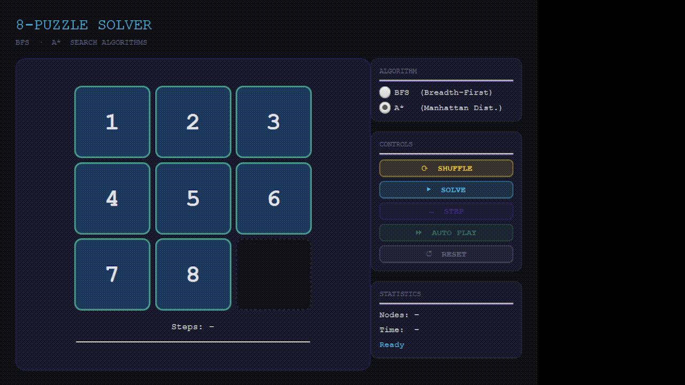

# 8-Puzzle Solver — JavaFX (BFS & A*)

## Features
- **BFS** — Breadth-First Search (uninformed, guarantees shortest path)
- **A*** — A* with Manhattan Distance heuristic (informed, much faster)
- Visual step-by-step playback (Step / Auto Play)
- Shuffle with solvability guarantee
- Live stats: nodes explored, solve time, step counter

## Showcase:

## Algorithm Comparison (hard puzzle example)
| Algorithm | Steps | Nodes Explored | Time   |
|-----------|-------|---------------|--------|
| BFS       | 31    | ~181,000      | ~750ms |
| A*        | 31    | ~8,000        | ~70ms  |

A* explores **22× fewer nodes** thanks to the Manhattan Distance heuristic.
